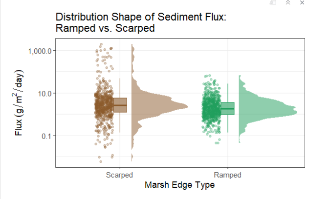

# 3. Results

*All results from linear models still working on it, but it seems like distance and z star are significant across models, and differences in marsh edge typology are approaching significance with a p value \~0.07. Would need more data to test mechanism*.

## 3.1 Sediment Deposition Across Ramped and Scarped Marsh Edges

## Across Space

### *Distance from Marsh Edge*


### *Relative Elevation with Tidal Inundation (z\*)*


## Across Time

### *Per Month (Need to Confirm Timing)*


### *Phenological and Seasonal (Working on It-Will Decide Very Soon)*

```         
```

### Main Takeaway Result to Close Out Results/Discussion for Future Work-Skewness!


