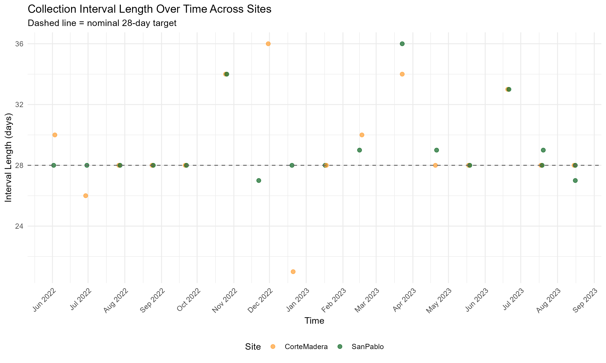
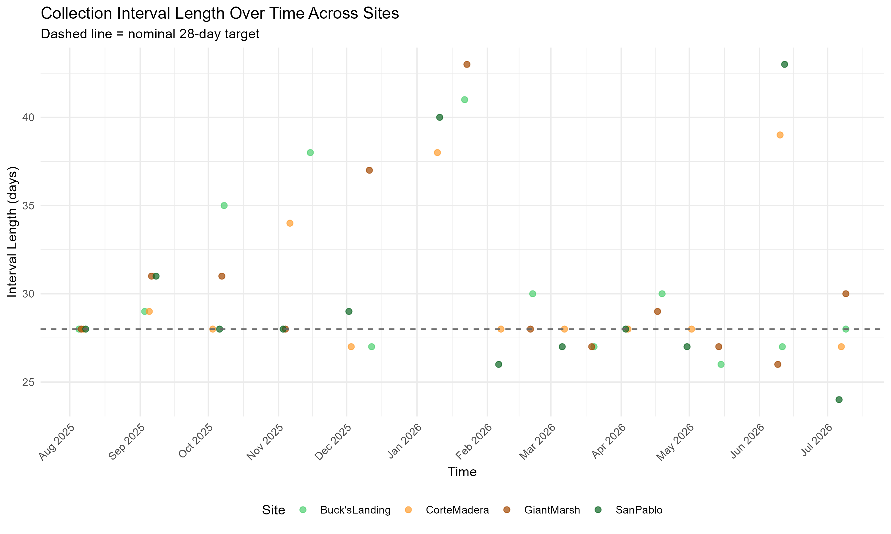
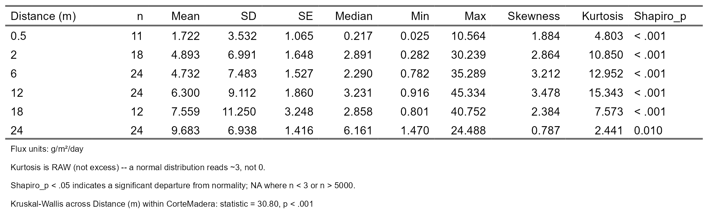

### 1. Introduction

### 2. Methods

#### 2.1 Study Sites

*Figure 1. General Study Site*

*Figure 2. General Study Site with Elevation Survey Benchmarks Included*

#### 2.2 Marsh Edge Typology

#### 2.3 Sediment Deposition Collections throughout the Year

*Figure 3. Transect Layout of Study Design With Ramped and Scarped Edges*

{width="705"}

*Figure 4. Deployment Length within Study Period (2022-2023)* 

*Figure 5. Deployment Length within Study Period (2025-2026)* 

#### 2.4 RTK Elevation Measurements for Horizontal Marsh Edge Profiles of 2025-2026 Study

*Figure 6. Elevation Profiles of Scarped Edges Sites-Giant Marsh and Corte Madera* 

*Figure 7. Elevation Profiles of Ramped Edges Sites-Buck's Landing and San Pablo* 

### 3. Analysis

### 4. Results

#### 4.1 Sediment Deposition Across Ramped and Scarped Marsh Edges

### Marsh Edge Typology Level

*Table 1. GLMM of Sediment Deposition Across Marsh Edge Types* 

### Site Level

*Figure 8. Sediment Deposition (Flux) Across Site Level of Ramped and Scarped Sites (2025-2026)* 

*Table 2. Statistical Table of Sediment Deposition (Flux) Across Site (2025-2026)* 

#### Tran-Site Level

*Figure 9. Sediment Deposition (Flux) Across Transect Nested in Site Level of Ramped and Scarped Sites (2025-2026)* 

*Table 3. GLMM of Sediment Deposition Across Transect Nested in Site Level of Ramped and Scarped Sites (2025-2026)* 

#### Z star level per site

*Figure 10. Sediment Deposition (Flux) Across z\* (Relative Elevation) Within Ramped and Scarped Sites (2025-2026)* 

*Table 4. GLMM of Sediment Deposition Across z\* (Relative Elevation) Within Ramped and Scarped Sites (2025-2026)* 

#### Distance Level Per Site

*Figure 11. Sediment Deposition (Flux) Across Distances from Marsh Edge Within Ramped and Scarped Sites (2025-2026)* 

*Table 5. Statistical Table of Sediment Deposition (Flux) Across Distances within Giant Marsh Site (2025-2026)* 

*Table 6. Statistical Table of Sediment Deposition (Flux) Across Distances within Corte Madera Site (2025-2026)* 

*Table 7. Statistical Table of Sediment Deposition (Flux) Across Distances within San Pablo Site (2025-2026)* 

*Table 8. Statistical Table of Sediment Deposition (Flux) Across Distances within Buck's Landing Site (2025-2026)* 

#### Temporally

*Figure 12. Sediment Deposition (Flux) Across July 2025 -October 2025 Within Ramped and Scarped Sites* 

*Figure 13. Sediment Deposition (Flux) Across November 2025 -February 2026 Within Ramped and Scarped Sites* 

*Figure 14. Sediment Deposition (Flux) Across March 2026 -June 2026 Within Ramped and Scarped Sites* 

*Table 9. Statistical Table of Sediment Deposition (Flux) Across Study Phase Collections (M#) within Corte Madera (2025-2026)* 

*Table 10. Statistical Table of Sediment Deposition (Flux) Across Study Phase Collections (M#) within Buck's Landing (2025-2026)* 

*Table 11. Statistical Table of Sediment Deposition (Flux) Across Study Phase Collections (M#) within San Pablo (2025-2026)* 

*Table 12. Statistical Table of Sediment Deposition (Flux) Across Study Phase Collections (M#) within Giant Marsh (2025-2026)* 

*Table 13. GLMM of Sediment Deposition (Flux) Across Summer (March-October) and Winter (November-February) Seasons Between Sites (2025-2026)*

#### 4.2 Sediment Deposition Rates Across Years in One Ramped and One Scarped Edge Marsh

*Study Dataset Comparison Across Ramped (San Pablo Marsh) and Scarped Edge (Corte Madera Marsh) Sites*

*Figure 15. Sediment Deposition (Flux) Across Study Datasets of 2022/2023 vs. 2025/2026 within Corte Madera and San Pablo Sites*

*Table 14. Statistical Table of Sediment Deposition (Flux) Across Study Datasets of 2022/2023 vs. 2025/2026 within Corte Madera and San Pablo Sites*

*Spatially*

*Figure 16. Sediment Deposition (Flux) Across Distances from Marsh Edge Within Between 2022/2023 vs. 2025/2026 in Corte Madera and San Pablo Sites*

*Table 15.Statistical Table of Sediment Deposition (Flux) Across Distances within Corte Madera Site (2022-2023)*

*Table 16. Statistical Table of Sediment Deposition (Flux) Across Distances within Corte Madera Site (2025-2026)*

*Table 17. Statistical Table of Sediment Deposition (Flux) Across Distances within San Pablo Site (2022-2023)*

*Table 18. Statistical Table of Sediment Deposition (Flux) Across Distances within Corte Madera Site (2025-2026)*

*Figure 18. Sediment Deposition (Flux) Across z (Relative Elevation) Across Study Datasets 2022/2023 vs. 2025/2026*

*Temporally*

*Figure 19. Sediment Deposition (Flux) Between Study Datasets of 2022/2023 vs. 2025/2026 Across July through October Within Corte Madera and San Pablo Sites*

*Figure 20. Sediment Deposition (Flux) Between Study Datasets of 2022/2023 vs. 2025/2026 Across November through March Within Corte Madera and San Pablo Sites*

*Figure 21. Sediment Deposition (Flux) Between Study Datasets of 2022/2023 vs. 2025/2026 Across March through June Within Corte Madera and San Pablo Sites*

*Table 19. Statistical Table of Sediment Deposition (Flux) Across Study Phase Collections (M#) within Corte Madera (2022-2023)*

*Table 20. Statistical Table of Sediment Deposition (Flux) Across Study Phase Collections (M#) within Corte Madera (2025-2026)*

*Table 21. Statistical Table of Sediment Deposition (Flux) Across Study Phase Collections (M#) within San Pablo (2022-2023)*

*Table 22. Statistical Table of Sediment Deposition (Flux) Across Study Phase Collections (M#) within San Pablo (2025-2026)*

#### 4.3 Sediment Deposition in Relation to Intra-Marsh Geomorphic Factors

*Intra-Marsh Geomorphic Factor Comparison*

*Figure 22. Least Absolute Shrinkage and Selection Operator (LASSO) Regression Model of Intra-Marsh Geomorphic Variables*

*Elevation and Distance from Marsh Edge*

*Figure 23. Comparing Average Flux and Variability Across Distance from Marsh Edge and z star*

*Figure 24. Variance Across Time and Space Between and Across Sites of Sediment Deposition (Flux)*

*Figure 25. Sediment Deposition (Flux) Across z star profiles Across Marsh Sites*

*Figure 26. Sediment Deposition (Flux) Across Distance Over Study Collections Between Sites*

*Figure 27. Corte Madera Site Case Study of Sediment Deposition (Flux) Across Distance from Marsh Edge Across Study Collections Between 2022/2023 vs. 2025/2026*

### 5. Discussion

### 6. Conclusion
