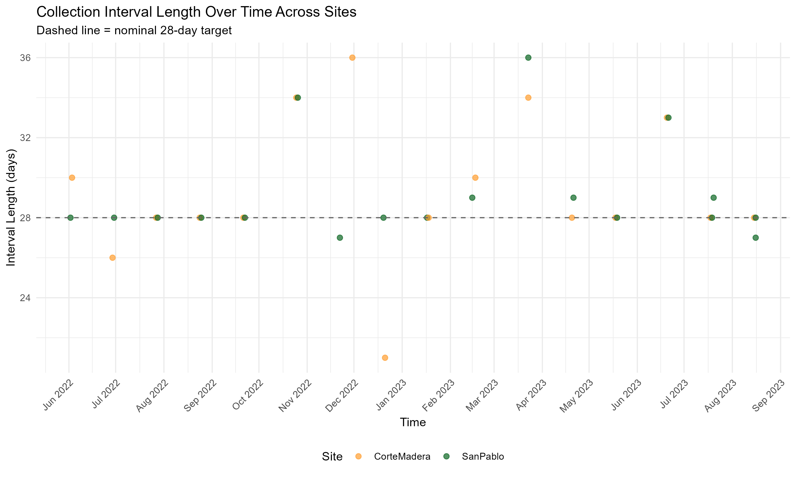
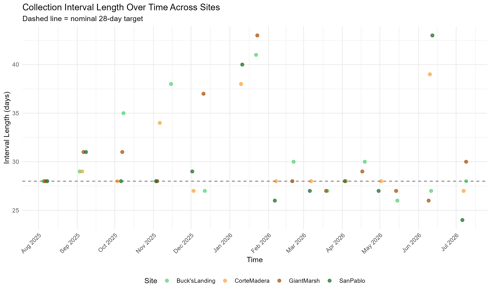

```{r}
source("C:\\Users\\savan\\OneDrive - San Francisco State University\\ProjectData\\GitHub\\DepositionSFB\\code\\R\\setup.R")
source("C:\\Users\\savan\\OneDrive - San Francisco State University\\ProjectData\\GitHub\\DepositionSFB\\code\\R\\plotting.R")

knitr::opts_chunk$set(echo = TRUE)
knitr::opts_knit$set(root.dir = 'C:/Users/savan/OneDrive - San Francisco State University/ProjectData/GitHub/DepositionSFB/images')
```

### 1.0 Introduction

- First discuss significance of protecting salt marshes in an urban-wildlife interface in the face of climate change

- Discuss nuances in formation and shape of tidal marshes

- Discuss how scarps are formed versus how ramped marshes are formed

- Discuss work that's been done on postulating how sediment forms around scarped and ramped marshes, tying it to pro grading and eroding marsh types on an exploratory basis (Beagle 2015 SFEI)

- Discuss why monitoring short term events, such as sediment deposition, could help managers and communities adapt and anticipate ways to protect their marshes, especially in light of expected extreme weather events such as extreme tidal flooding, sea level rise, and drought.

- We hypothesize that sediment deposition rates can correlate to different marsh edge typologies over space and time. Given permitting and availability constraints of year round sampling of marshes within the San Francisco Bay, this work is exploratory and cannot be used to propose geomorphic processes within the marshes of this local estuarine system due to the low sample size of marshes used to represent each typology (n = 2).

- Present research questions:

  - Does marsh edge type correlate to rates of short term sediment deposition?

  - Do rates of short term sediment deposition change across years within one ramped marsh and one scarped marsh within the same periods of time sampled?

  - Do other site specific factors besides marsh edge type hold a greater correlation to short term sediment deposition?

### 2.0 Methods

#### 2.1 Study Sites

The San Francisco Bay Estuary is a highly urban estuary within the state of California in one of the most urbanized regions of the state. There are riverine influences that vary in scale, from the fresh water of the Sacramento and San Joaquin Delta, as well as local tributaries starting within the surrounding mountain ranges, many of which have been disconnected from their original path. Much of the footprint around the San Francisco Bay has been filled or diked for human development, however through the efforts of communities, some remaining and restored marsh lands still reside as the intermediary between tidal waters and the terrestrial landscape. This study focused on marshes located within the Northern and Central area of the Estuary, where many planned and completed research projects are located and are adjacent to a subembayment of the San Pablo Bay. This area of the estuary is unique through its proximity to the freshwater flow of the Delta inflows, as well as the strong tidal influence of from the Golden Gate. Sites for this study were chosen based on permitting availability for a year-long, monthly study, repeatability with past studies methods, diversity of positions within the estuary, as well as marsh edge typology based on the work from the Shifting Shorelines report by San Francisco Estuary Insitutute. Marsh edges were defined by presence of a Scarp and a Ramp, as the inflection point and vegetation had a stronger potential of objectivity upon repeated measuring. To enhance comparability, two scarped marshes-San Pablo Marsh and Buck's Landing, and two ramped marshes-Corte Madera Marsh and Giant Marsh, were picked for a year of monitoring from July 2025-2026. One ramped marsh, San Pablo Marsh, and one scarped marsh, Corte Madera Marsh, were chosen based on past studies from U.S. Geological Survey in 2022-2023 in order to compare those rates across time and further understand the marsh edge typologies significance to sediment deposition across longer scales of time.

San Pablo Marsh contains a ramped marsh edge typology. It is located at the northern most part of the estuary, facing relative south to the San Pablo Bay and is adjacent to California Highway 37. It is due East of the Petaluma River mouth opening, which contains a shipping channel for the Port of Petaluma for recreational and commerical traffic. The San Pablo Marsh is part of a larger complex of tidal channels and tidal pannes with influence from both riverine and estuarine sources. The vegetation is composed mostly of Salicornia pacifica (Pickleweed) with a belt of vegetation of Spartina foliosa (Cordgrass) on the lower part of the bayward marsh that is frequently inundated.

Corte Madera Marsh contains a scarped marsh edge typology. It is located in the Central Bay facing the Richmond Bay Bridge, adjacent to Highway 101 and a shopping mall with a parking lot. The marsh is generally sheltered through the Sir Frances Drake Peninsula (look for actual name that's appropriate here) and faces East into the San Francisco Bay. There is the San Rafael river nearby the marsh, as well as a commuter ferry whose route is roughly parrallel to that of the marsh edge shoreline. The vegetation is composed mostly of Pickleweed, Distichiulus, and Cordgrass in patches throughout the landscape of the marsh. jawmea

Buck's Landing Marsh contains a ramped marsh edge typology. It is located on the Western side of the estuary, facing North towards the top of the San Pablo Bay and the adjacent opening of Gallinas Creek. Buck's Landing has tidal influence, as well as direct contact through the freshwater influences of Gallinas Creek. This site also had observed scarped and ramped edge morphology throughout the site, apart from the areas of the site measured. There is a boat ramped on the west side of the site, as well as powerlines overhead. The vegetation is mostly composed of Pickleweed, with some other species throughout and a belt of Cordgrass on the lower part of the bayward marsh that is frequently inundated, jawmea

Giant Marsh contains a scarped marsh edge typology. It is located in the San Pablo Bay, facing west on the East side of the bay within Point Pinole Regional Park. The marsh has some riverine influences (look up where this river is) nearby it that is disturbed by human infrastructure and nearby housing developments. There is also directly in front of the marsh there are experimental oyster reefs and old pillons from an older deck. In addition, this marsh is parallel to the Richmond Outer and Pinol Shoals deep water shipping channels. The vegetation is mostly composed of Pickleweed and Distichulus.

- San Francisco Bay Estuary within the watershed and the outflows, tidal influences, etc.

- Show map of all the sites in a table, first the map of all of them at the top. Then each site, includes benchmarks of the transects. See if you can find specific photos of each site characters

- Environmental characteristics about the storm, etc.

- Describe each of the sites

  - Higher elevation relative to each other

  - Riverine sources

  - Sheltered relatively from other sites, open to other

  - See which datum you're using

  - Watershed dimensions? Not sure how important this is and where to get this information

#### 2.2 Marsh Edge Typology

Marsh Edge typologies were characterized using the broad categories from the San Francisco Estuary Institute report, "Shifting Shorelines". Two sites fell under the "Scarped" marsh edge typology, while two sites fell under the "Ramped" marsh edge typology. The sites were categorized based on the following observeable traits of a steep cliff like change from the marsh platform to the mudflat-scarped, or a steady transition zone between the two-ramped. Ramped marsh edge morphologies measured all had a belt of Cordgrass (Spartina foliosa) transition between the mudflat and the marsh platform, whereas the scarped marsh edges measured started with cordgrass at the beginning of sampling, but had eroded by the end of the study or were not observed again at either site near the marsh transition to mudflat.

The marsh edge was decided differently betweeen scarped and ramped marsh edges. For scarped sites, the marsh edge was determined based on the location of the edge of the cliff. For the ramped sites, the marsh edge was determined where the majority of the Cordgrass belt started from the Pickleweed pre-dominant area of the marsh platform. The determination of the marsh edge in ramped sites, due to the vegetation signature standing as the diagnostic, was not as definitive as the scarped marsh edge. This interpretation led to differences between one the ramped sites, San Pablo Marsh, which we compared to an earlier dataset collected by U.S. Geological Survey in 2022-2023.

To test the significance of marsh edge typology on sediment deposition, the transects started perpendicular to the marsh edge (approximately 1 meter from the determined edge) moving inland.

For the compared dataset between 2022-2023 and 2025-2026, Corte Madera transects were roughly parallel to the distances collected in the previous study, allowing for sediment deposition measurements to be comparable. In the 2022-2023 dataset of San Pablo marsh, the transect started past the belt of Cordgrass into the mudflat, which with the logarthimc offset misaligned the distance collections of our study. As such, for comparison of 2022-2023 and 2025-2026 studies, "Marsh Areas" were grouped together with the overlapping distances between temporal collections, starting from the edge of the marsh with the cordgrass belt into "Edge" and "Platform" categories.

Upon each visit to the marsh, a photo was taken perpendicular to the edge, directly facing the transect pole 1 foot to the left of the transect. These photos were taken to track change over time in vegetation and the marsh edge morphology throughout the seasons qualitatively. Measurements of each transect, starting from the transect pole to the nearest edge were taken, determined by their typology characteristics (Table 1).

- Outlines with position on a map of the transects within the bay with an aerial transect per each marsh. Include the 2022 collection locations, as well as the channel vs. bay transects

- Show map again of the sites, this time characterizing the wind fetch angle, and broad categories of open vs. protected, vs. west-east-south facing

- Table that includes all this information

#### 2.2 Sediment Deposition Collections throughout the Year





- Collections of sediment completed in 2022-2023 by the U.S. Geological Survey that measured Corte Madera and San Pablo marsh in both channel and bay transects.

- This study repeated the same methodology of the USGS study at those same sites from the bay transects, and added the Buck's Landing (ramped) and Giant Marsh (scarped) sites.

- Within this study, the time periods of July 2022-June 2023 were compared to that of July 2025-June 2026.

- Show a diagram and a table that shows the deployment distances, the replicates, and the number of samples per month total

- Show a graph that displays the average deployment times of each data collection throughout the year (see if you can color code the sites)

#### 2.3 RTK Elevation Measurements for Horizontal Marsh Edge Profiles of 2025-2026 Study

- Have a table that includes the timing of monitoring and a photo of the elevations being taken

- Show the location of the benchmarks, and include the coordinate systems used

- Explain z\* as a concept, and explain that each transect will be compared with z\* rather than elevation as it is more representative of tidal flooding

- Outlines the horizontal profile of each marsh with elevation on the y axis and distance on the x

## 3. Results

#### 3.1 Sediment Deposition Across Ramped and Scarped Marsh Edges

- Simplest graph-scarped marsh edges and ramped marsh edges box plot showing lax of significance

  - Include a statistical summary table below that, which includes skewness as a metric

- Then go to site specific box plots, keeping the same color code

  - Include a statistical summary table below that, which includes skewness as a metric

- Show two different graphs in relation to each other:

  - One graph should show Distance relationship over time, with marsh edge general linear model

  - One graph should show Monthly/seasonal relationship over time with the marsh edge general linear model

  - z\* for each of the sites using a scatter plot, showing the clumping of values per site at certain flux values per z\*

#### 3.2 Sediment Deposition Rates Across Years in One Ramped and One Scarped Edge Marsh

- Show similar plots to the one completed in 3.2, this time with year as the variable in facet_wrapped plots of the year differences

- Plot the precipitation differences between each of the years to illustrate the comparison between years

#### 3.3 Sediment Deposition in Relation to Intra-Marsh Geomorphic Factors

- Bring the plots for Corte Madera and Buck's Landing transects, just to show how even when clumping these two geomorphically similar marshes, there is differences specific to the marsh in terms of sediment deposition

- Show outputs for LASSO that have Dist, z\*, marsh edge type, slope, compass bearing?, skewness? Discussion

### 4. Discussion

#### 4.1 Sediment Deposition Across Ramped and Scarped Marsh Edges

#### 4.2 Sediment Deposition Rates Across Years in One Ramped and One Scarped Edge Marsh

#### 4.3 Sediment Deposition in Relation to Intra-Marsh Geomorphic Factors

- Bring up the channel vs. bay plots to demonstrate how individually within a marsh sediment deposition varies even within the same time period

#### 4.4 Limitations of Study

#### 4.5 Case Study of Ramped and Scarped Marshes

- The results of this study can only be presented as case studies of 2 different marsh edge typologies: ramped and scarped. As the study's results presented themselves, the sampling number increased based on the relative elevation of each marsh being different from each other, resulting in one lower elevation marsh (one scarped and one ramped) and one higher elevation marsh (one scarped and one ramped). As such, future studies should either expand the number of ramped and scarped sites to test marsh edge typology as a variable, or unify the elevation amongst the site options so they can test marsh typology more concretly, as the LASSO output showed a strong favor for z\* as a factor, and past studies have emphasized the importance of tidal elevation as a driver of sediment deposition. In addition, two of these marshes shared both a general geomorphic direction (east facing) and a "protected" bay, while the other two marshes were characterized as "open bay" without protection, and with two different compass bearings (south and west facing). Ideally, future studies should pick adjacent marshes that have similar compass directions and embayyment protections. However, given the small number of marshes available for research, and the risk for disturbance over a consistent, monthly year long study, this could be difficult to find in order to run a comparative study specifically looking at marsh edge typology.

#### 4.6 Scarped West-Facing Marshes of the Urban East Bay

- All of these marshes are adjacent to human structures, and are located within a heavily urban estuary adjacent to major shipping channels

- These marshes are remenants of what was existing and it is hard to capture what dynamics these marshes had pre-urbanization when we're in a rush to keep what we have, making it more important to complete comparative work of existing marshes to understand the specific dynamics at play with sustaining and building them naturally.

- Giant Marsh is a good example well supported locally of a western facing scarped, eroding marsh. Recent results of Whale's Tale holds similarity in findings and systems at these scarps need more in detail study on the intraspecific factors at play that influence these dynamics

  - These western faced marshes are especially important socially as they are often adjacent and abutting large city communities of the East Bay. Understanding how these marshes currently work and how we can sustain them can help promote the benefits of marshes for urban communities as places of recreation, community building, and nature based feature protections against coastal flooding. Many of these existing marshes have been cut off or altered from their original riverine local inputs, which likely can have a huge effect on the sediment inputs of these marshes as discussed in 3.3, and implied within the results of 3.2 from Corte Madera across years, which is protected but has small riverine inputs. These marshes appear to be eroding quickly through their scarped edge, and they provide both an urgent and abundant solution for nature based features in urban communities against sea level rise.

### 5. Conclusion

This study stands as one of the first to compare rates of sediment deposition across marshes, using marsh edge typology specifically as a categorical variable. Due to the small sampling size between marshes, this study should be viewed as a case study for future studies to repeat methods and protocols. The results of this study imply that intra specific marsh variables such as the tidal elevation, and distance from the marsh edge are important for sediment deposition which has been shown from past research. Future studies would aid from collecting additional field data within each site such as wave energy in front of the marsh edge, and wind direction. Additional studies of repeated long term monitoring of both scarped and ramped edged marshes will allow for more robust understanding on how to protect marshes over increased expected sea level rise, and possibly provide insight on what factors are most important to promote sediment deposition in marshes so we can expand vertical migration ahead of sea level rise.
